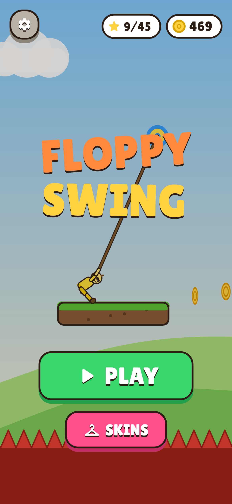
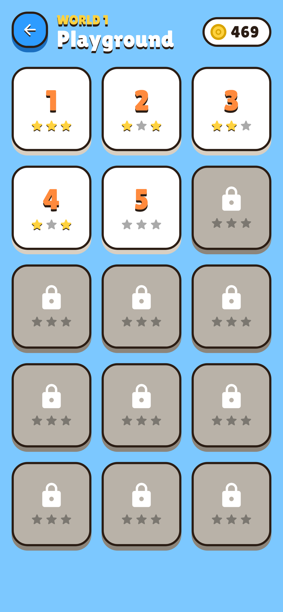
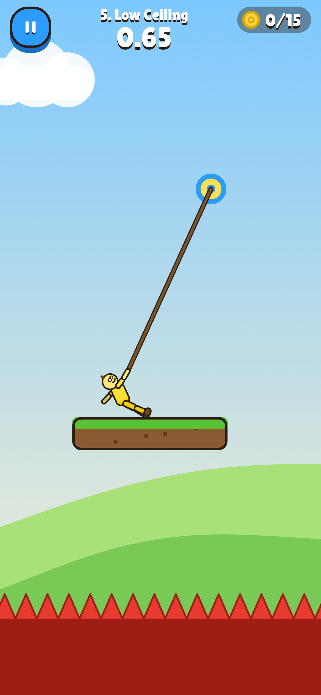
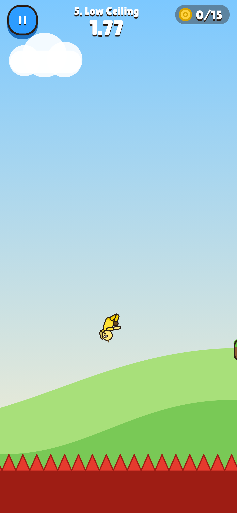
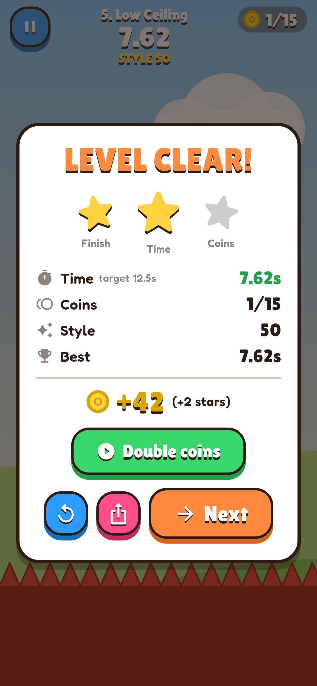
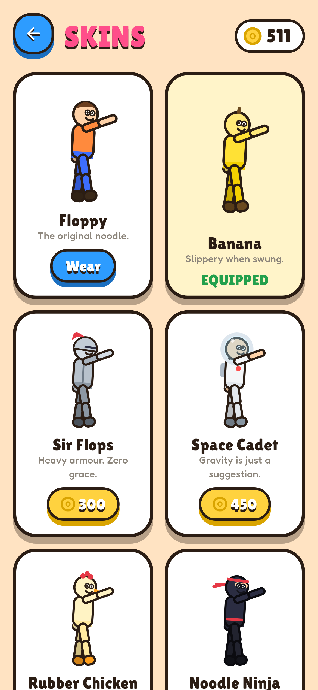

# Floppy Swing

A one-thumb, physics-based ragdoll grappling game for **iOS and Android**,
built from one Flutter codebase. Hold anywhere to fire the rope at the
highlighted ring, let go to fly. Fails are replayed in slow motion and can be
shared as vertical clips.

| Menu | Levels | Swinging | Slow-mo fail | Level clear | Skins |
|---|---|---|---|---|---|
|  |  |  |  |  |  |

This is the **MVP milestone** from the design document (section 15).

## What's in the MVP

- **One-touch controls:** hold to grab the nearest ring in range (it glows), release to let go.
- **Floppy 2D ragdoll**, 10 parts on limited revolute joints, with a rope (max-length joint) on the front hand.
- **Obstacles:** spikes, spinning saws (static and moving), bounce pads, plus a spike pit.
- **15 levels** (World 1 "Playground"), each with a finish, coins, a target time, and checkpoints on longer levels.
- **Instant retry:** tap during or after a fail to restart. There are no menus in between, and rebuilding the physics world takes about 1–2 ms.
- **Slow-motion fail replay:** a zoomed 0.4× replay with a comic burst and a second helping of the fail sound. Tap to skip.
- **Share clip:** a 720×1280 (9:16) MP4 of the last few seconds plus the slow-mo replay, with a watermark and a "Can you do better?" end card, shared through the native share sheet.
- **Stars** (finish, target time, all coins), **coins**, and **style points** (flips, close calls, hang time, big swings, combos).
- **6 skins**: 1 free and 5 unlockable with coins. Each has its own fail sound.
- **Rewarded ads:** revive at a checkpoint (or pay coins), and double coins after a level. There are no interstitials, and never an ad right after a fail.
- Menu with an attract-mode demo (the autopilot plays level 1), level select, skins shop, settings (music and SFX volume, mute, vibration, privacy options, reset).
- Generated sound effects and chiptune music (`tool/gen_audio.py`), plus haptics.

## Tech choices (the doc's open decisions)

| Decision | Choice | Why |
|---|---|---|
| Engine | **Flutter + Flame + Forge2D** | The owner already knows Flutter. Box2D physics, first-party plugins for ads, sharing and IAP, one codebase for both stores. |
| Rope | **Rope (max-distance) joint**, drawn as a sagging curve | Stable and tunable, and still looks floppy. The hand–anchor link can go slack, and the ragdoll limbs supply the floppiness. |
| Backend | None yet | Leaderboards and cloud save aren't in the MVP. Progress is one JSON blob (`ProgressStore`), so it's ready to sync. |
| Economy | `assets/config/economy.json` | 2 coins per coin picked up, +10 per finish, +15 per new star, skins 150–800, revive 60. |
| Art | Procedural vector drawing | No asset pipeline needed to test the fun. Skins are colour sets plus accessories in `lib/game/skins.dart`. |

### About the physics engine (important)

`forge2d` 0.15+ replaced its Dart engine with native Box2D v3 built through
native-asset hooks. That route is newer and riskier for mobile builds, so this
project uses the mature pure-Dart **forge2d 0.14.2+1**, **vendored in
`third_party/forge2d` with bug fixes**. Its revolute joint solved its mass
matrix wrongly, and a ragdoll exploded on its very first physics step. See
`third_party/forge2d/PATCHES.md`.

## Project layout

```
lib/
  game/            Pure game logic (no widgets)
    simulation.dart   Headless, deterministic physics sim: rope, hazards, pickups, style
    ragdoll.dart      Ragdoll body parts and joints
    level.dart        Level model / JSON format
    config.dart       Physics + economy config (loaded from JSON)
    game_controller.dart  Fixed-step loop, camera, phases, retry, replay, revive
    renderer.dart     Draws a frame (used for live play, replays and clip export)
    autopilot.dart    Bot player (level verification + menu demo)
    skins.dart        Skin catalogue
    floppy_game.dart  Thin Flame wrapper
  services/        Progress/save, audio+haptics, ads (UMP consent), clip export, analytics
  ui/              Screens and widgets
assets/
  config/physics.json   <- tune the feel here
  config/economy.json
  levels/level_XX.json
  audio/, fonts/
android/.../VideoEncoderPlugin.kt   MediaCodec MP4 encoder for clips
ios/Runner/AppDelegate.swift        AVAssetWriter MP4 encoder for clips
tool/
  check_levels.dart   Proves every level is beatable (and can auto-place coins)
  death_map.dart      Shows where the bot dies on a level
  gen_audio.py        Synthesises all sounds and music
```

## Running

```bash
flutter pub get
flutter run            # on a connected iPhone/Android device or simulator
flutter test           # physics, levels, economy, controller and UI tests
flutter analyze
```

iOS needs Xcode (deployment target 15.0) and Android needs the Android SDK
(minSdk 24). Both use the standard `flutter build ipa` / `flutter build appbundle`.

## Tuning the feel

All swing physics live in `assets/config/physics.json`: gravity, rope range
and reel-in, swing pump, release boost, knockback strength, bounce pad speed,
floppiness and more. Each field is documented in `lib/game/config.dart`. Hot
restart picks up changes.

After changing physics or levels, re-verify the levels:

```bash
dart run tool/check_levels.dart            # search + write test/level_solutions.json
dart run tool/check_levels.dart --balance  # also re-place coins along a proven path
                                           # and reset each level's target time
flutter test test/levels_test.dart
```

## Level format

Meters with **y pointing down**. Boxes are `[centerX, centerY, width, height, angleDeg?]`.

```json
{
  "id": 3, "name": "Pointy Bits", "targetTime": 12.5, "hint": "optional tutorial text",
  "start": [3.5, -2], "killY": 6,
  "finish": [59, -3, 5, 7],
  "platforms": [[3, 0, 5, 1]],
  "anchors": [[5, -8], [14, -8.5]],
  "spikes": [[9.5, 3, 2, 6]],
  "saws": [{"x": 18.5, "y": 0, "r": 1.2, "to": [18.5, -7], "period": 3.2}],
  "pads": [[24, 1.2, 3.5, 0.6, 15]],
  "coins": [[9.3, -1.9]],
  "checkpoints": [[50, 0.5]]
}
```

Rules the tests enforce: the first anchor must be reachable from the start
platform, and every checkpoint needs an anchor in reach, because revives spawn
there.

## Before releasing

- **Ads:** the AdMob ids are Google's public *test* ids. Replace them in
  `lib/services/ads_service.dart`, `AndroidManifest.xml` and `ios/Runner/Info.plist`
  (`GADApplicationIdentifier`). Configure the GDPR and IDFA messages in AdMob's
  Privacy & messaging, which the app already shows through UMP.
- **Share text:** set the store link in `ShareText` (`lib/services/clip_exporter.dart`).
- **Bundle ids:** `com.floppyswing.floppy_swing` on both platforms. Also set up
  release signing, and replace the app icons (still the Flutter defaults).
- **Analytics:** `lib/services/analytics.dart` only logs for now. Plug in
  Firebase or similar there.

## Not in the MVP (next milestones)

Gems and real-money IAP, Season Pass, Daily Challenge and leaderboards, Endless
mode, Friend Ghosts, Fail of the Week, Worlds 2–5, interstitial ads, cloud
save, and paid fail effects and trails.
